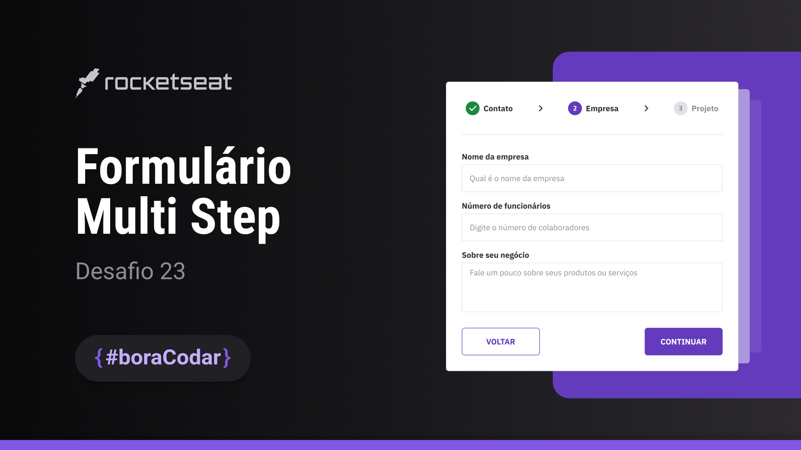

<h1 align="center"> #boraCodar um formulário multi step - Desafio #23</h1>

Bem-vindos ao #boraCodar, um convite em forma de desafio para você apostar na sua evolução em programação.

E como funciona?

É simples: toda semana, às quartas-feiras, nós lançamos um desafio inédito na página oficial do #boraCodar para você codar com a gente. Sem guias ou tutoriais, você fica livre para criar a sua versão. Depois disso, na próxima semana, lançamos um vídeo como esse, com a resolução do desafio.  

  <a href="#-tecnologias">Tecnologias</a>&nbsp;&nbsp;&nbsp;|&nbsp;&nbsp;&nbsp;
  <a href="#-projeto">Projeto</a>&nbsp;&nbsp;&nbsp;|&nbsp;&nbsp;&nbsp;
  <a href="#-layout">Layout</a>&nbsp;&nbsp;&nbsp;|&nbsp;&nbsp;&nbsp;
  <a href="#memo-licença">Licença</a>

  

 

  

## 🚀 Tecnologias

Esse projeto foi desenvolvido com as seguintes tecnologias:

- HTML, CSS e JavaScript
- Git e Github
- Figma

## 💻 Projeto

Desenvolva um formulário dividido em etapas. Use sua criatividade e fique à vontade para ir além nesse projeto.

## 🔖 Layout

Você pode visualizar o layout do projeto através [DESSE LINK](https://www.figma.com/community/file/1248257890741817885). É necessário ter conta no [Figma](https://figma.com) para acessá-lo.

## :memo: Licença

Esse projeto está sob a licença MIT.

---

Feito com ♥ by Lucas :wave: [Participe da comunidade da RocketSeat!](https://discord.gg/rocketseat)
